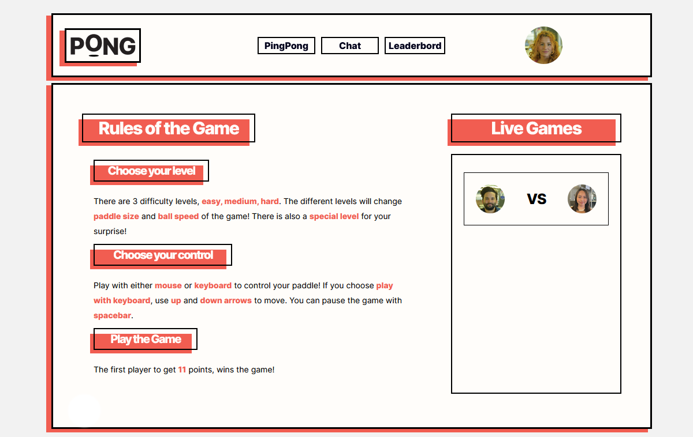
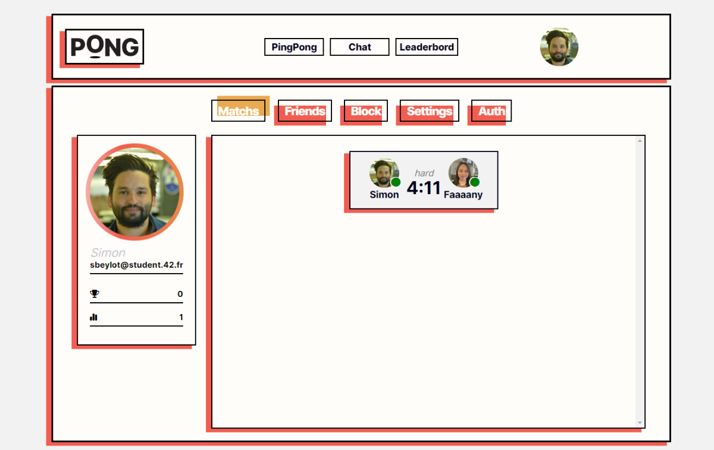
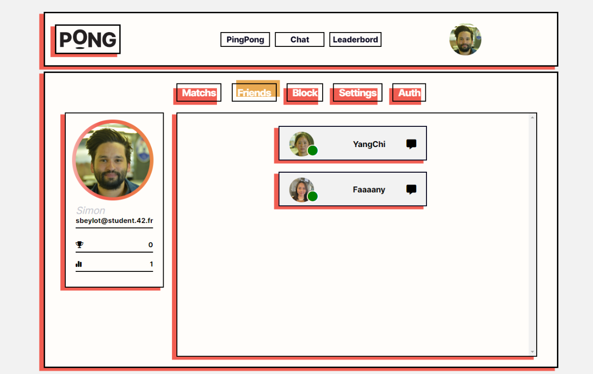
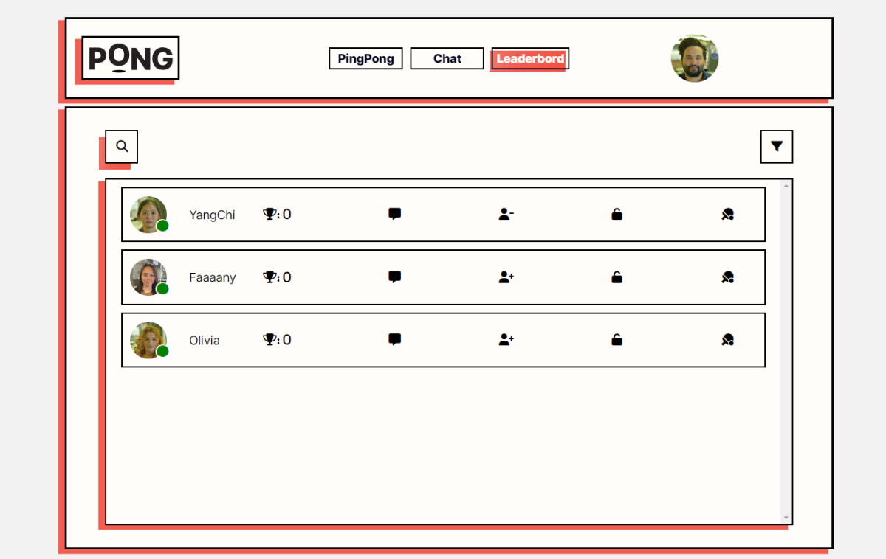
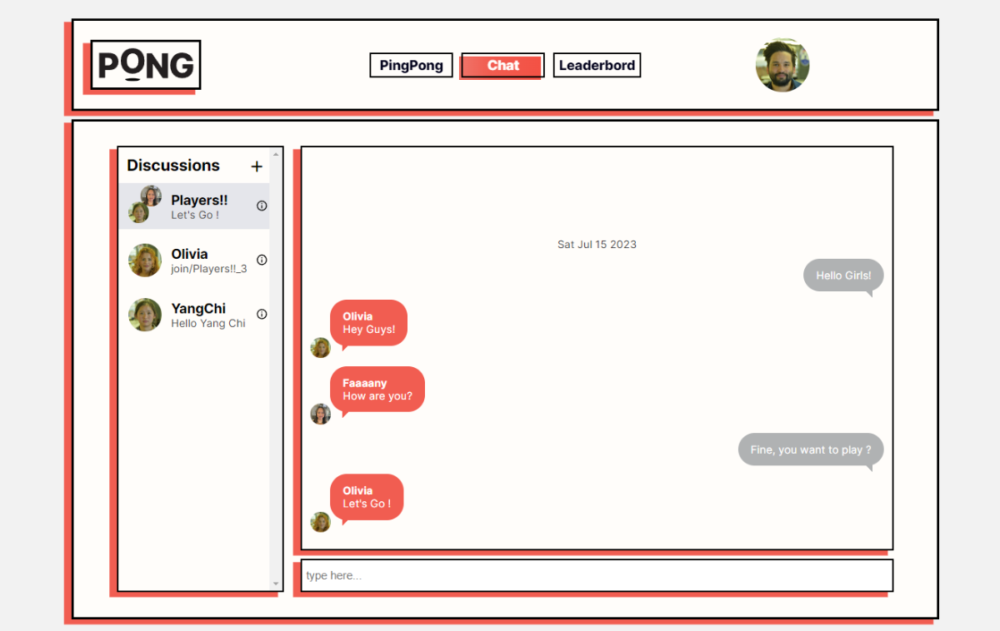

# ft_transcendence || 42 Project

**ft_transcendence** from **42 School** is the last project of the commom core.

## Summary
"No more C! No more C++!
This project is about doing something you’ve never done before.
Remind yourself the beginning of your journey in computer science.
Look at you now. Time to shine!"

This project is about creating a website for the mighty Pong contest!

### Tools
-   React
-   NestJs
-   PostgreSQL

## Homepage

## Users

## Pong

## Chat

https://github.com/bCigueS/ft_transcendence/assets/48445174/d4d55c8e-c921-45a9-8fab-ad6f2919dbd8

## Team
[bCigueS](https://github.com/bCigueS)
[olivwalsh](https://github.com/olivwalsh)
[foctavia](https://github.com/foctavia)
[yangchi-42](https://github.com/Chenade)

